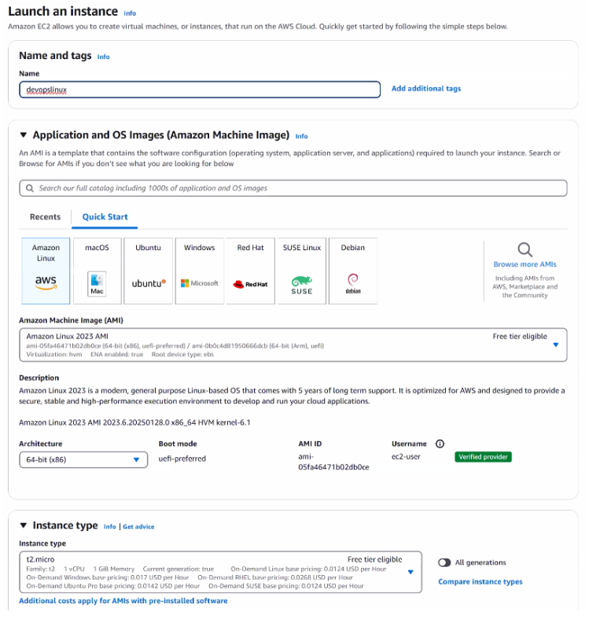
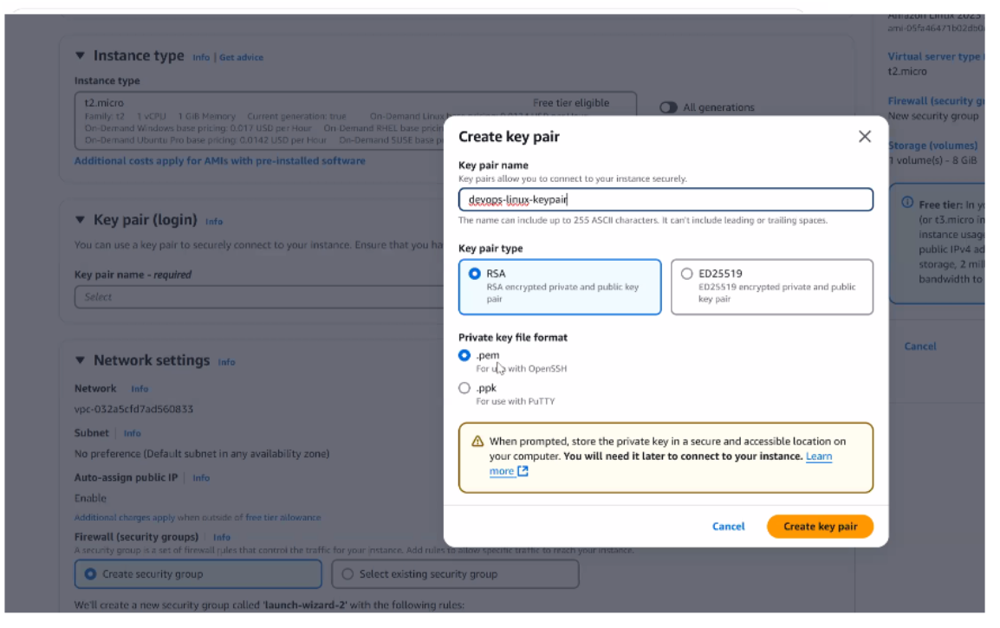
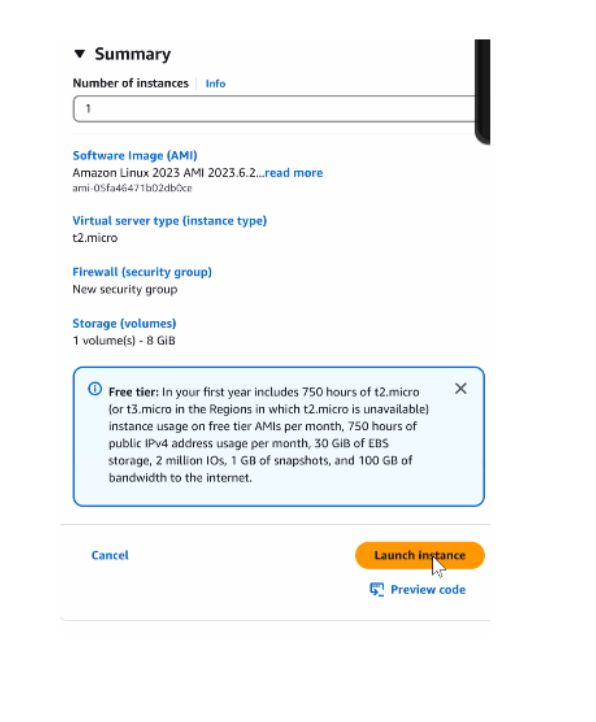

# **AWS EC2 Instance Creation Guide (Free Tier)**

Follow these steps to create an EC2 instance on AWS Free Tier securely and efficiently.

### **Step 1: Sign in to AWS and Open EC2 Dashboard**

- Navigate to the [AWS Management Console](https://aws.amazon.com/console/).
- Sign in with your AWS account credentials.
- In the AWS Console, search for **EC2** in the top search bar and open the EC2 Dashboard.

### **Step 2: Launch a New Instance**

- Click on **"Launch Instance"**.
- Provide a name for your instance (e.g., "MyEC2Instance").

### **Step 3: Choose an Amazon Machine Image (AMI)**

- Select **Amazon Linux 2** (Free tier eligible) or **Ubuntu 22.04 LTS**.
- Click **"Select"**.

### **Step 4: Choose Instance Type**

- Choose **t2.micro** (Free tier eligible) as the instance type.
- Click **"Next"**.

### **Step 5: Configure Instance Details**

- Keep the default settings unless specific configurations are needed.
- Click **"Next"**.



### **Step 6: Add Storage**

- By default, AWS provides **8GB of SSD storage** under the free tier.
- Modify only if needed.
- Click **"Next"**.

### **Step 7: Configure Security Group**

- Create a new security group or select an existing one.
- Allow SSH (Port 22) for remote access (restricted to your IP for security).
- Click **"Next"**.

### **Step 8: Review and Launch**

- Review all configurations.
- Click **"Launch"**.
- Select **"Create a new key pair"**, provide a name, and download the `.pem` file (this is needed to SSH into your instance).


- Click **"Launch Instance"**.


### **Step 9: Access the EC2 Instance**

#### **Using SSH (Terminal/Command Line)**

- Go to the **EC2 Dashboard** > **Instances**.
- Copy the **Public IPv4 Address** of the running instance.
- Open a terminal and connect using SSH:
  ```bash
  ssh -i your-key.pem ec2-user@your-public-ip
  ```

### **Step 9.1: Connect Using MobaXterm**

- Download and install **[MobaXterm](https://mobaxterm.mobatek.net/)**.
- Open MobaXterm and click on **"Session"**.
- Select **"SSH"** as the session type.
- In the **"Remote host"** field, enter the **Public IPv4 Address** of your EC2 instance.
- Under **Advanced SSH Settings**, check **"Use private key"** and browse to select your downloaded `.pem` key.
- Click **"OK"** to connect.
- You should now have access to your EC2 instance via MobaXterm.

### **Step 10: Manage Your Instance**

- Stop, Start, or Terminate the instance from the EC2 dashboard as needed.

### **Best Practices**

- Always download and securely store your private key.
- Restrict SSH access to your IP address only.
- Terminate unused instances to avoid unwanted charges.

By following these steps, you can successfully create and manage an EC2 instance using AWS Free Tier.
